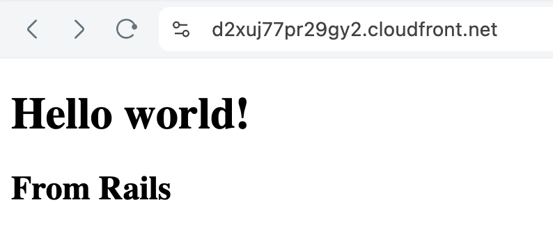

# Rails on AWS Fargate with AWS CDK
 


## Architecture

See the [CDK code](./infra/bin/infra.ts) for the full architecture.

- A VPC with public, private, private isolated subnets
- An ECS cluster with a Fargate service
- A Route 53 private hosted zone for the ECS service (AWS CloudMap/Service Discovery)
- API Gateway w/ VPC Link Integration to the ECS service using the private DNS name
- An ECS task definition with a container that runs the Rails app
- A CloudFront distribution with an API Gateway origin

## Deploy to AWS with CDK

First, you need to install [aws-cdk](https://www.npmjs.com/package/aws-cdk).

Next, create an [SSM parameter](https://docs.aws.amazon.com/systems-manager/latest/userguide/systems-manager-parameter-store.html)
with the Rails master key at `/rails-tf-example/prod/RAILS_MASTER_KEY`. Your master key can be found in the `config/master.key` file.
This key is used to decrypt the Rails credentials file in the ECS task definition.

```bash
cd infra
npm install
# Bootstrap the CDK environment
cdk bootstrap --qualifier railscdk
# Deploy the stacks
cdk deploy --all
```
